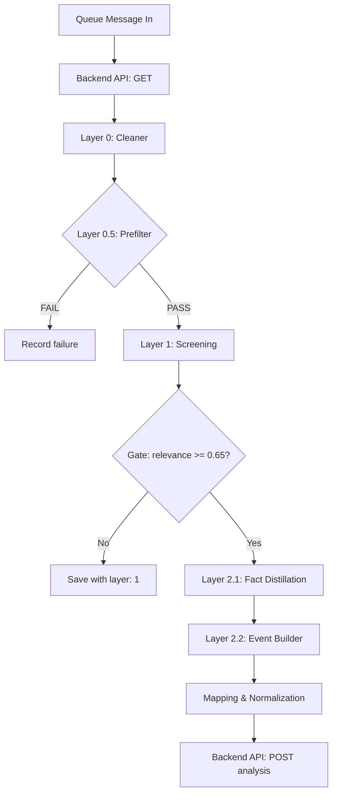
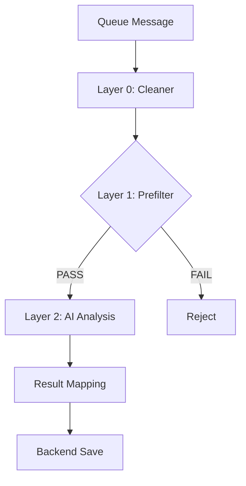

# Cloudflare Worker README Generator

This skill specializes in creating and maintaining comprehensive README.md files for Cloudflare Workers, following the established patterns in the TokenBel project (e.g., `tb-news-ai-analyzer`).

## When to Use This Skill

- Creating a new Cloudflare Worker and need a README.md
- Updating an existing Worker's README.md with new features or changes
- Documenting business logic, environment variables, and service dependencies
- Generating Mermaid diagrams for service relationships
- Standardizing README format across multiple Workers

## When NOT to Use This Skill

- **Non-Cloudflare projects**: Use other skills for non-Worker projects
- **Simple scripts**: For trivial Workers without complex logic, a minimal README may suffice
- **User provides their own template**: Respect user's explicit template choice

## README Structure Template

The generated README follows this comprehensive structure:

```
# {worker-name}

## Overview
- Brief description of the Worker's purpose
- Main functionality summary

## Business Logic
- Detailed workflow description
- Message flow / processing pipeline
- Layer-by-layer analysis (if applicable)
- Decision trees and gating logic

## Queue Message Contracts
- Input message interface/types
- Output actions (ack, retry, etc.)

## Service Bindings
- Cloudflare infrastructure bindings
- External service dependencies

## Configuration
- wrangler.toml configuration
- Environment variables with defaults

## {Additional Sections as needed}
- Event Types / Classification Schemes
- AI Model & Prompts (for AI Workers)
- Error Handling
- Performance Considerations
- Security Considerations
- Data Flow Summary (with Mermaid)
- Project Structure
- Dependencies
- Testing
- Deployment
- Monitoring & Observability
- Integration with Other Services
- Version History
- Related Workers
- Related Backend Code
```

## Key Components to Document

### 1. Environment Variables

Document all required and optional environment variables:

```markdown
| Variable          | Default                           | Description          |
| ----------------- | --------------------------------- | -------------------- |
| `API_DOMAIN`      | `https://dashboard.tokenbel.info` | Backend API base URL |
| `MISTRAL_API_KEY` | (secret)                          | Mistral AI API key   |
```

### 2. Service Bindings

Document Cloudflare bindings and external services:

```markdown
### Cloudflare Infrastructure

| Binding Type   | Name                        | Purpose                               |
| -------------- | --------------------------- | ------------------------------------- |
| Queue Consumer | `tb-news-raw-article-saved` | Trigger: receives messages to process |
| Secret Store   | `TB_API_TOKEN`              | Backend API authentication            |

### External Service Dependencies

| Service          | Endpoint                                          | Purpose                   |
| ---------------- | ------------------------------------------------- | ------------------------- |
| TokenBel Backend | `GET /api/internal/news/raw-articles/{id}`        | Fetch raw article content |
| Mistral AI       | `POST https://api.mistral.ai/v1/chat/completions` | AI analysis               |
```

### 3. Mermaid Diagrams

Generate flowcharts for complex workflows:



### 4. Business Logic

Document the processing pipeline in detail:

```markdown
### Message Flow

1. **Queue Trigger**: Consumes messages from `{queue-name}` queue
2. **Env Validation**: Resolves secrets, validates required env vars
3. **Message Validation**: Validates message shape and version
4. **Data Fetch**: Retrieves data from backend API
5. **Layer 0 Processing**: Initial data cleaning/normalization
6. **Layer 1 Processing**: Primary analysis/transformation
7. **Result Persistence**: Saves results to backend
```

## Workflow

### Step 1: Gather Information

Collect the following information about the Worker:

1. **Worker Name**: The name of the Cloudflare Worker (e.g., `tb-news-ai-analyzer`)
2. **Purpose**: What the Worker does in 1-2 sentences
3. **Queue Bindings**: Which queues it consumes/produces
4. **Secret Bindings**: Required secrets from Cloudflare Secrets Store
5. **Environment Variables**: All configuration variables
6. **External Services**: APIs and services it interacts with
7. **Business Logic**: The processing pipeline and decision points
8. **Message Contracts**: Input/output message formats
9. **Project Structure**: File organization
10. **Dependencies**: npm packages and shared utilities

### Step 2: Analyze Existing Code

If updating an existing Worker:

1. Read the current README.md (if exists)
2. Examine the main Worker file (`.ts` or `.js`)
3. Check `wrangler.toml` for configuration
4. Review `package.json` for dependencies
5. Look at test files for additional context
6. Check for any prompt files or generated code

### Step 3: Generate README Structure

Create the README with all relevant sections. Use the example from `tb-news-ai-analyzer` as a reference.

### Step 4: Add Mermaid Diagrams

Create visual representations of:

- Data flow through the Worker
- Integration with other services
- Decision trees and gating logic
- Error handling paths

### Step 5: Document Configuration

Include complete `wrangler.toml` configuration and all environment variables with their purposes and defaults.

### Step 6: Add Related Information

Link to:

- Related Workers (upstream/downstream)
- Related backend code
- API endpoints used
- Test files

## Example: Minimal Worker README

For a simple Worker:

````markdown
# tb-simple-worker

Cloudflare Worker that performs X functionality.

## Overview

`tb-simple-worker` is a queue consumer that processes Y from the Z queue.

## Business Logic

1. Consumes messages from queue
2. Validates message
3. Performs transformation
4. Saves result

## Queue Message Contracts

### Input Message

```typescript
interface InputMessage {
  id: number;
  data: string;
}
```
````

## Service Bindings

| Binding Type   | Name          | Purpose                      |
| -------------- | ------------- | ---------------------------- |
| Queue Consumer | `input-queue` | Receives messages to process |

## Configuration

```toml
[vars]
API_DOMAIN = "https://api.example.com"
```

## Project Structure

```
cf_workers/tb-simple-worker/
├── src/
│   └── worker.ts
├── wrangler.toml
└── package.json
```

````

## Example: Complex Worker README

For a Worker with AI processing (like `tb-news-ai-analyzer`):

```markdown
# tb-ai-processor

Cloudflare queue consumer that performs AI-powered analysis using X models.

## Overview

Implements a multi-layer processing pipeline:

````

Layer 0: Cleaner (Text Normalization)
↓
Layer 1: Prefilter (Rule-based)
↓
Layer 2: AI Analysis (Model-based)
↓
Backend Persistence

````

## Business Logic

### Message Flow

1. **Queue Trigger**: Consumes from `input-queue`
2. **Layer 0**: Text normalization
3. **Layer 1**: Rule-based filtering
4. **Layer 2**: AI analysis
5. **Result Mapping**: Normalize and prepare results
6. **Backend Save**: Persist results

### Layer 0: Cleaner

- Unicode normalization
- Invisible character removal
- Text normalization rules

### Layer 1: Prefilter

- Minimum length check
- Pattern matching
- Fast rejection of irrelevant content

### Layer 2: AI Analysis

- Model: mistral-small-latest
- Prompt version: v1
- Timeout: 120s

## Service Bindings

### Cloudflare Infrastructure

| Binding Type | Name | Purpose |
|-------------|------|---------|
| Queue Consumer | `input-queue` | Trigger |
| Secret Store | `AI_API_KEY` | AI provider authentication |

### External Service Dependencies

| Service | Endpoint | Purpose |
|---------|----------|---------|
| AI Provider | `POST https://api.provider.com/v1/chat` | AI analysis |
| Backend | `POST /api/results` | Save results |

## Configuration

```toml
[[queues.consumers]]
queue = "input-queue"
max_batch_size = 1

[[secrets_store_secrets]]
binding = "AI_API_KEY"
store_id = "..."
secret_name = "AI_API_KEY"

[vars]
MODEL = "mistral-small-latest"
TIMEOUT_MS = "120000"
````

## Data Flow Summary



````

## Best Practices

### For AI Workers

1. **Layer Processing**: Split logic into layers (cleaner → prefilter → AI)
2. **Gating**: Only proceed to AI if prefilter passes
3. **Cost Optimization**: Filter before AI calls to save costs
4. **Error Handling**: Distinguish retryable vs non-retryable errors
5. **Audit Trail**: Keep raw AI responses for debugging

### For Queue Workers

1. **Batch Size**: Set appropriate `max_batch_size`
2. **Retry Logic**: Configure `max_retries` appropriately
3. **Message Validation**: Validate message shape and version
4. **Content Hash**: Verify content integrity when applicable

### For All Workers

1. **Secrets Management**: Use Cloudflare Secrets Store
2. **Structured Logging**: Use shared logger utilities
3. **Type Safety**: Use TypeScript with proper types
4. **Testing**: Include vitest tests with miniflare
5. **Documentation**: Keep README updated with changes

## Templates

See the `templates/` directory for reusable README sections:

- `business-logic-template.md` - Business logic section template
- `mermaid-flowchart.md` - Mermaid diagram examples
- `service-bindings.md` - Service bindings table template
- `configuration.md` - Configuration section template

## References

- [Cloudflare Workers Documentation](https://developers.cloudflare.com/workers/)
- [wrangler.toml Configuration](https://developers.cloudflare.com/workers/wrangler/configuration/)
- [Mermaid Syntax](https://mermaid.js.org/syntax/flowchart.html)
- [TokenBel Worker Patterns](./references/tokenbel-patterns.md)

## Quick Start: Creating a README

1. **Navigate to Worker directory**:
   ```bash
   cd /workspace/Red-Panda-Dev__tbel/cf_workers/{worker-name}
````

2. **Gather information**:
   - Read the main Worker file
   - Check `wrangler.toml`
   - Review `package.json`
   - Examine test files

3. **Create README.md** with the structure above

4. **Add Mermaid diagrams** for complex workflows

5. **Document all environment variables** and bindings

6. **Link to related code** (backend, other Workers)

## Checking Existing Workers

To see examples of well-documented Workers:

```bash
# List all Workers with README files
find /workspace/Red-Panda-Dev__tbel/cf_workers -name "README.md" -type f

# View a specific README
cat /workspace/Red-Panda-Dev__tbel/cf_workers/tb-news-ai-analyzer/README.md
```

Use these as references when creating new README files.
