# Mermaid Flowchart Templates

Use these templates for creating Mermaid diagrams in Cloudflare Worker README files.

## Basic Flowchart Structure

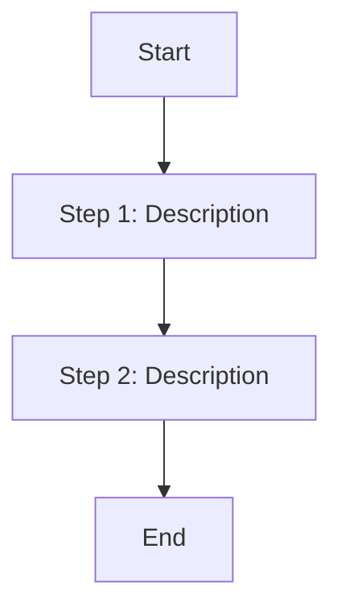

## Queue Worker Flowchart

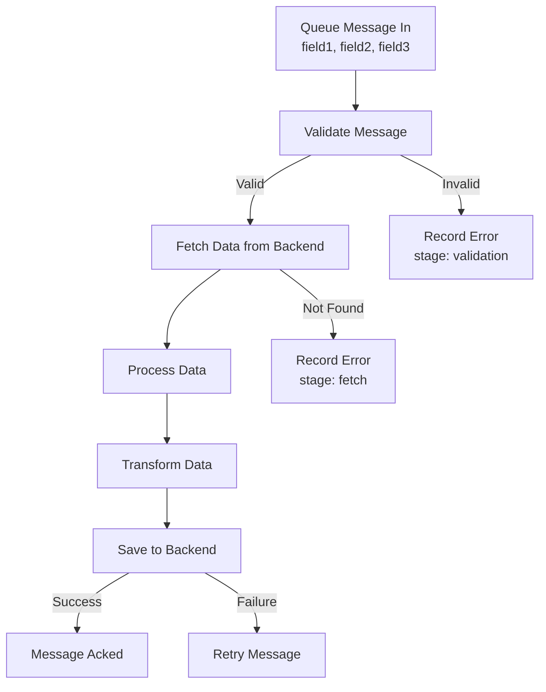

## Multi-Layer Processing Flowchart (AI Worker)

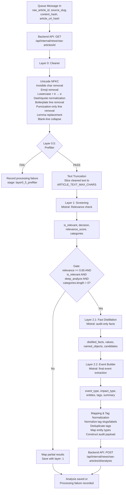

## Decision Tree Flowchart

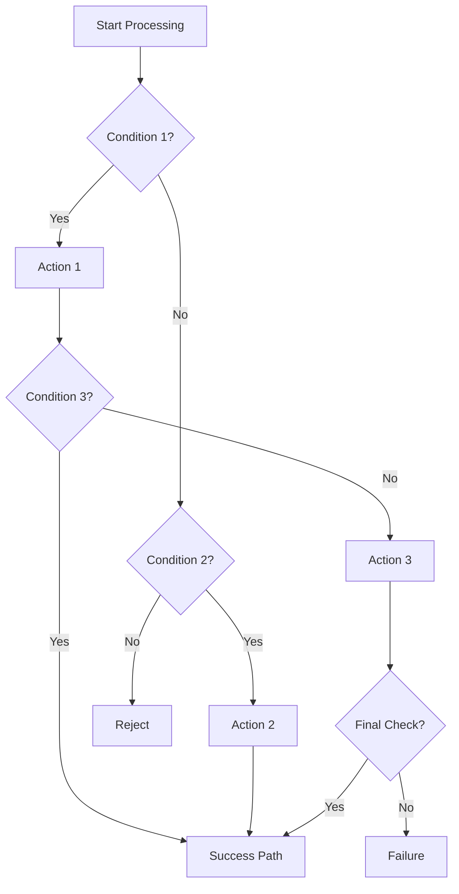

## Error Handling Flowchart

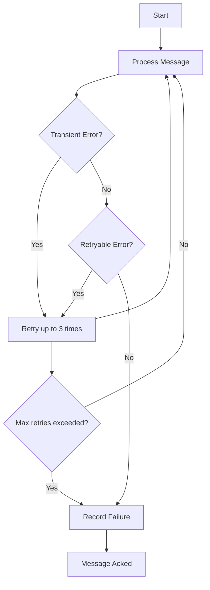

## Service Integration Flowchart

```mermaid
flowchart TD
    subgraph Cloudflare
        WORKER[Cloudflare Worker]
        QUEUE[Queue: tb-news-raw-article-saved]
        SECRETS[Secrets Store]
    end
    
    subgraph External Services
        BACKEND[TokenBel Backend\nhttps://dashboard.tokenbel.info]
        MISTRAL[Mistral AI\nhttps://api.mistral.ai]
    end
    
    QUEUE -->|Trigger| WORKER
    SECRETS -->|API_TOKEN\nMISTRAL_API_KEY| WORKER
    
    WORKER -->|GET /api/internal/news/raw-articles/{id}| BACKEND
    WORKER -->|POST https://api.mistral.ai/v1/chat/completions| MISTRAL
    WORKER -->|POST /api/internal/news/raw-articles/{id}/analysis| BACKEND
    WORKER -->|POST /api/internal/news/raw-articles/{id}/processing-failure| BACKEND
```

## Data Flow with Upstream/Downstream

```mermaid
flowchart TD
    subgraph Upstream
        EXTRACTOR[tb-news-article-extractor]
    end
    
    subgraph Current Worker
        ANALYZER[tb-news-ai-analyzer]
    end
    
    subgraph Downstream
        BACKEND[TokenBel Backend]
        DATABASE[(Database)]
    end
    
    EXTRACTOR -->|Consumes: tb-news-articles-discovered| EXTRACTOR
    EXTRACTOR -->|Fetches article HTML| EXTRACTOR
    EXTRACTOR -->|Extracts normalized Markdown| EXTRACTOR
    EXTRACTOR -->|Saves to backend| BACKEND
    EXTRACTOR -->|Produces: tb-news-raw-article-saved\n(if should_analyze=true)| ANALYZER
    
    ANALYZER -->|Consumes: tb-news-raw-article-saved| ANALYZER
    ANALYZER -->|GET /api/internal/news/raw-articles/{id}| BACKEND
    ANALYZER -->|POST analysis results| BACKEND
    ANALYZER -->|POST processing failures| BACKEND
    
    BACKEND -->|Saves to| DATABASE
```

## Scheduled Worker Flowchart

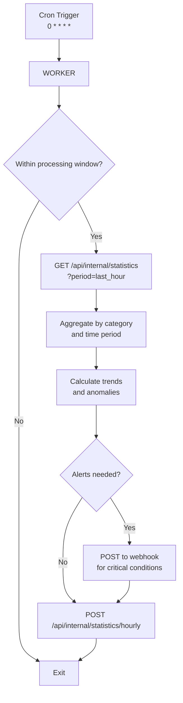

## Batch Processing Flowchart

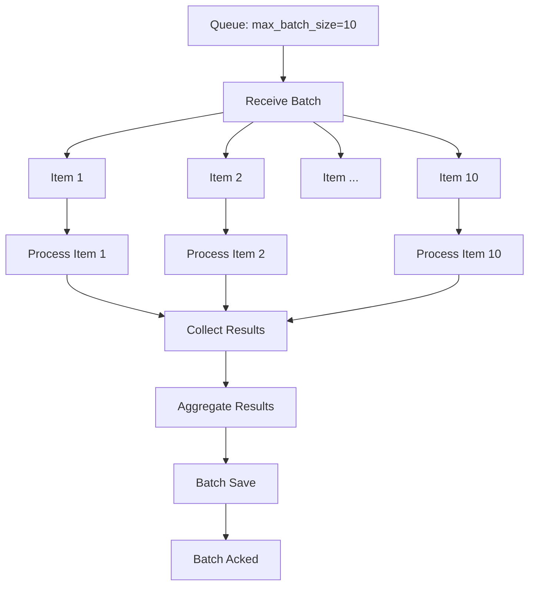

## State Machine Flowchart

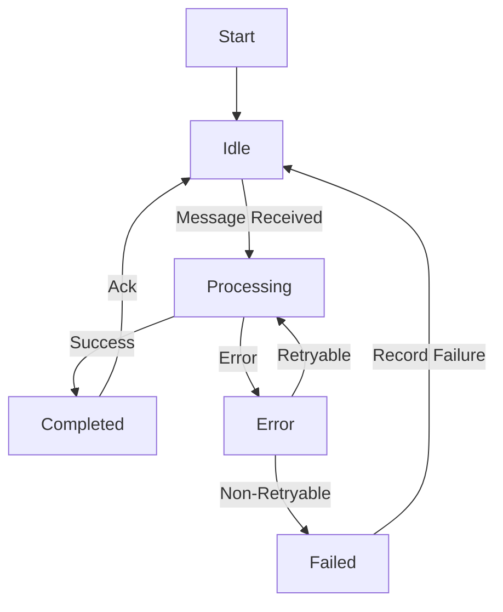

## Parallel Processing Flowchart

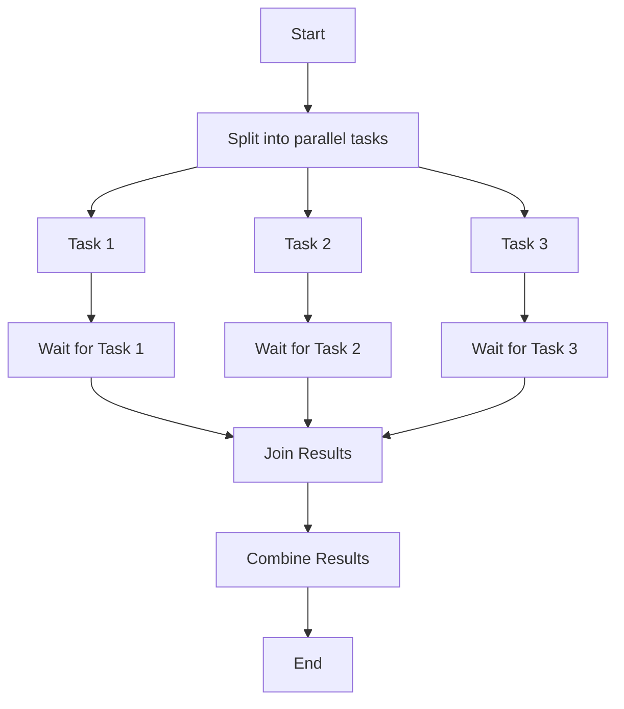

## Customizing Diagrams

### Adding Styles

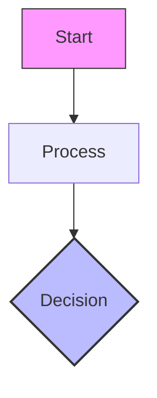

### Adding Classes

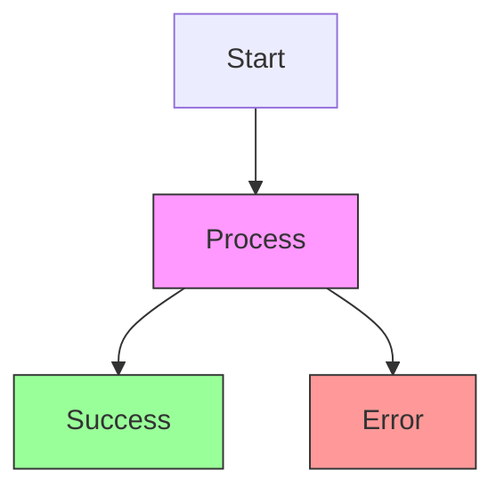

### Adding Notes

```mermaid
flowchart TD
    A[Step 1] --> B[Step 2]
    B --> C[Step 3]
    
    note right of A
        This is a note about Step 1
        It can span multiple lines
    end note
```

### Subgraphs for Grouping

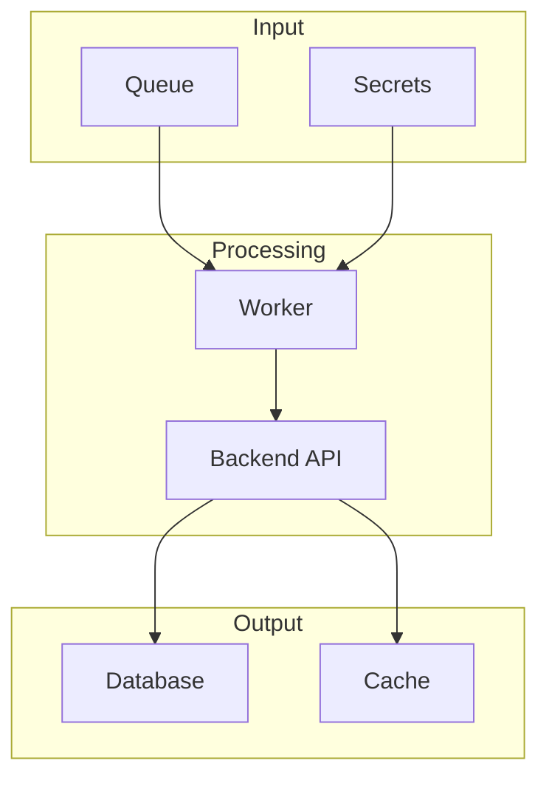

## Best Practices for Worker Diagrams

1. **Start with the trigger**: Queue, Cron, or HTTP request
2. **Show the main flow**: Primary processing path
3. **Include decision points**: Use diamonds (`{}`) for conditions
4. **Show error paths**: Use arrows with labels for different outcomes
5. **Group related components**: Use subgraphs for Cloudflare vs External services
6. **Keep it readable**: Limit to 10-15 nodes for complex diagrams
7. **Use consistent naming**: Match variable and function names from code
8. **Add notes for context**: Explain non-obvious decisions or optimizations
