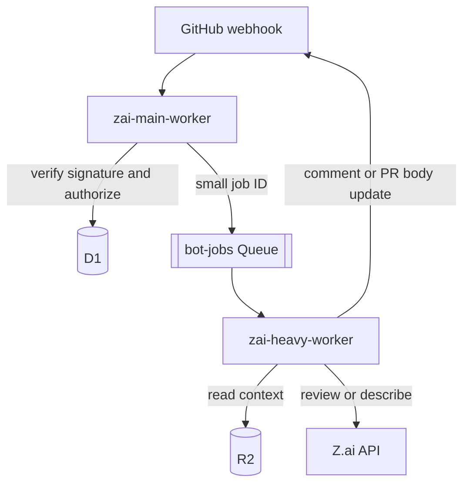

# Z.ai Code Bot Workers

Cloudflare Workers that receive GitHub webhooks and provide these bot commands:

- `/zai help` — lists the available commands.
- `/zai review` — runs a full-context pull-request review with Z.ai and updates
  one marker-owned review comment.
- `/zai describe` — synthesizes a pull-request description from commit history
  and updates the marker-owned section of the PR body.

## Architecture



`zai-main-worker` validates webhook requests, authorizes PR commenters, gathers
fresh PR context on head-producing PR events, and publishes durable jobs.
`zai-heavy-worker` consumes those jobs, claims them in D1, retries transient
failures, calls Z.ai, and writes the result back to GitHub.

## Repository layout

```text
poc/
├── package.json
└── workers/
    ├── shared/                 # GitHub, Z.ai, auth, comments, D1/R2/KV
    ├── zai-main-worker/        # webhook ingress and job publisher
    ├── zai-heavy-worker/       # Queue consumer and command handlers
    └── tests/                  # Workers unit tests
```

## Configuration

The main worker requires:

| Binding                 | Purpose                                       |
| ----------------------- | --------------------------------------------- |
| `GITHUB_WEBHOOK_SECRET` | GitHub HMAC webhook secret                    |
| `GITHUB_TOKEN`          | GitHub API token for authorization and writes |
| `BOT_DB`                | Durable job and publication state             |
| `BOT_JOBS`              | Queue producer                                |
| `BOT_ARTIFACTS`         | Gathered PR context and command results       |
| `BOT_CACHE`             | Repository configuration and PR card cache    |

The heavy worker consumes `BOT_JOBS` and requires `GITHUB_TOKEN`, `ZAI_API_KEY`,
`BOT_DB`, `BOT_ARTIFACTS`, and `BOT_CACHE`. `ZAI_MODEL` defaults to `glm-5.2`.
Secrets are configured through Cloudflare Secrets Store; no credentials belong
in `wrangler.toml` or source files.

## Development and deployment

```bash
cd poc
npm install
npm test
npm run dev:main
npm run dev:heavy
npm run deploy:main
npm run deploy:heavy
```

The main worker webhook URL must be configured in the GitHub repository webhook
settings for `pull_request`, `issue_comment`, and
`pull_request_review_comment` events.

## Queue contract

Queue messages contain no secrets or patches:

```json
{
  "schemaVersion": 1,
  "jobId": "d1-job-id"
}
```

D1 is authoritative. A consumer acknowledges completed and terminally failed
jobs, retries transient failures, and a five-minute main-worker cron recovers
expired leases and unpublished outbox rows.

## Security

- Webhook signatures are verified with Web Crypto before payload processing.
- Commands require collaborator authorization.
- Queue payloads contain only an opaque D1 job ID.
- User-visible errors are sanitized; provider credentials are never posted.
- The heavy worker has no public route or service binding endpoint.

## License

MIT. See [LICENSE](LICENSE).
