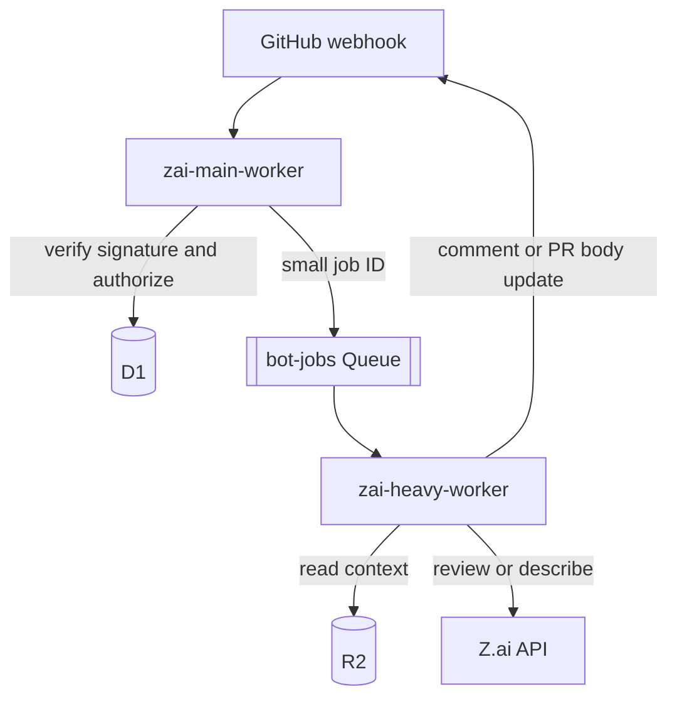
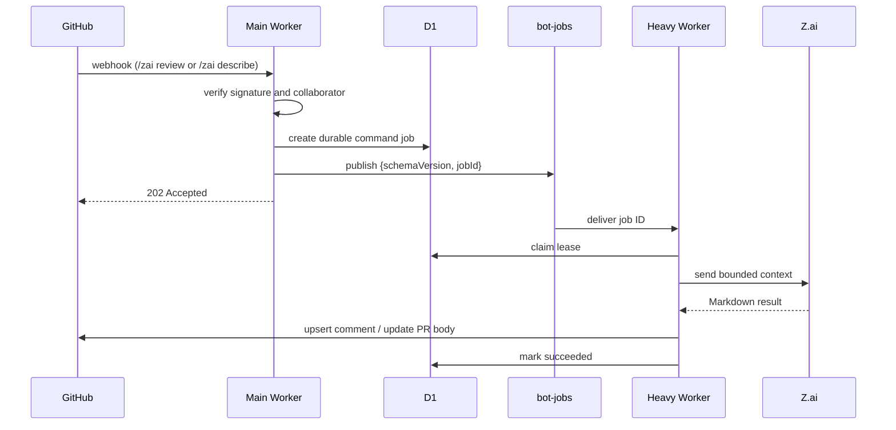

# Z.ai Code Bot

Cloudflare Workers that turn `/zai` GitHub PR comments into Z.ai-powered
review and describe results:

- `/zai help` — lists the available commands. Handled inline by the main
  Worker after signature verification and authorization; no D1 job, no Queue
  message.
- `/zai review` — runs a full-context pull-request review with Z.ai and updates
  one marker-owned review comment.
- `/zai describe` — synthesizes a pull-request description from commit history
  and updates the marker-owned section of the PR body.

All other commands are intentionally unsupported.

## Architecture



`zai-main-worker` (`src/zai-main-worker/`) is the public webhook ingress: it
verifies the HMAC signature, authorizes commenters, refreshes PR context, and
publishes opaque `{ schemaVersion, jobId }` messages to the `bot-jobs` Queue.
It also runs the bounded cron sweep that recovers expired jobs and replays the
outbox.

`zai-heavy-worker` (`src/zai-heavy-worker/`) is the private Queue consumer: it
claims jobs in D1 and runs the `review`, `describe`, `pr_context`, and internal
`pr_summary` handlers. It has no HTTP endpoint and no service binding.
Review/describe results are published idempotently through marker-owned GitHub
comments; `describe` also updates only its own section in the PR body;
`pr_summary` stores structured JSON context in R2 and does not publish a
GitHub comment.

## Command flow



Pull-request `opened`, `reopened`, `synchronize`, and `ready_for_review` events
create a `pr_context` job. The gatherer stores V2 context in R2 under
`v2/prs/{repositoryId}/{prNumber}/context/`: manifest, files, commits,
description, comments, and one patch artifact for each changed text file. After
the manifest is committed, it creates an idempotent `pr_summary` job for the
same PR head and publishes it immediately when the heavy worker's queue
producer is available; the D1 outbox remains the recovery path. That job sends
bounded context reconstructed from the V2 per-file patches to Z.ai, validates
the structured JSON response, and stores it at
`v2/prs/{repositoryId}/{prNumber}/context/pr-summary.json`. A later review
command uses a matching-head summary as auxiliary context and treats the
reconstructed snapshot diff as authoritative.

## Repository layout

```text
src/
├── shared/               # GitHub, Z.ai, auth, comments, D1/R2/KV libraries
├── zai-main-worker/      # webhook ingress and job publisher (own AGENTS.md)
├── zai-heavy-worker/     # Queue consumer and command handlers (own AGENTS.md)
└── tests/                # Workers unit tests
```

## Configuration

Worker-specific bindings and routes are defined in
`src/zai-main-worker/wrangler.toml` and `src/zai-heavy-worker/wrangler.toml`.
D1, R2, KV, and Queue bindings are shared by both workers.

The main worker requires:

| Binding                 | Purpose                                       |
| ----------------------- | --------------------------------------------- |
| `GITHUB_WEBHOOK_SECRET` | GitHub HMAC webhook secret                    |
| `GITHUB_TOKEN`          | GitHub API token for authorization and writes |
| `BOT_DB`                | Durable job and publication state             |
| `BOT_JOBS`              | Queue producer                                |
| `BOT_ARTIFACTS`         | Gathered PR context and command results       |
| `BOT_CACHE`             | Repository configuration and PR card cache    |

The heavy worker consumes `BOT_JOBS` and requires `GITHUB_TOKEN`, `ZAI_API_KEY`,
`BOT_DB`, `BOT_ARTIFACTS`, and `BOT_CACHE`. The model is controlled by
`ZAI_MODEL` and defaults to `glm-5.2`.

Required secrets are `GITHUB_WEBHOOK_SECRET`, `GITHUB_TOKEN`, and `ZAI_API_KEY`.
Secrets are configured through Cloudflare Secrets Store; no credentials belong
in `wrangler.toml` or source files.

## Development and deployment

```bash
npm install
npm test
npm run dev:main
npm run dev:heavy
npm run deploy:main
npm run deploy:heavy
```

The main worker webhook URL must be configured in the GitHub repository webhook
settings for `pull_request`, `issue_comment`, and
`pull_request_review_comment` events.

Prompt sources live in `src/zai-heavy-worker/prompts/`; regenerate committed
prompt modules with `npm run generate:prompts` from that worker directory.

## Queue contract

Queue messages contain no secrets or patches:

```json
{
  "schemaVersion": 1,
  "jobId": "d1-job-id"
}
```

D1 is authoritative. A consumer acknowledges completed and terminally failed
jobs, retries transient failures, and a five-minute main-worker cron recovers
expired leases and unpublished outbox rows.

## Security

- Webhook signatures are verified with Web Crypto before payload processing.
- Commands require collaborator authorization.
- Queue payloads contain only an opaque D1 job ID.
- User-visible errors are sanitized; provider credentials are never posted.
- The heavy worker has no public route or service binding endpoint.

See [SECURITY.md](SECURITY.md) for trust boundaries and [RUNBOOK.md](RUNBOOK.md)
for operational failure modes and recovery.

## License

MIT. See [LICENSE](LICENSE).
