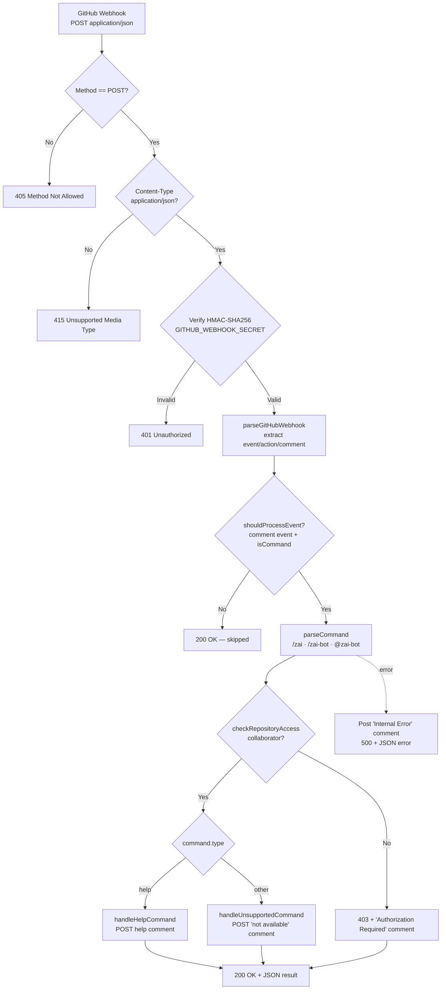

# zai-code-bot-poc

Cloudflare Worker that receives GitHub webhook events and handles the `/zai help` command — a **Proof-of-Concept (POC)** validating the migration of `zai-code-bot` from GitHub Actions to Cloudflare Computer.

## Overview

`zai-code-bot-poc` is an **HTTP webhook-driven Cloudflare Worker** (a `fetch` handler, not a queue or cron Worker). It is triggered by GitHub `issue_comment` / `pull_request` webhooks, verifies the webhook signature, authorizes the commenter as a repository collaborator, and posts a help message back to the issue/PR via the GitHub REST API.

```text
GitHub Webhook (POST) → Cloudflare Worker → GitHub REST API → Comment posted
```

### Scope

This POC implements **only** the `/zai help` command to validate the Cloudflare Computer architecture and measure performance (latency, cost, reliability) relative to the GitHub Actions runtime. All other `/zai` commands (`review`, `ask`, `explain`, `describe`, `impact`) are recognized but respond with a "not available in POC" notice rather than executing.

- **Trigger**: GitHub webhook HTTP request (POST, `application/json`)
- **Runtime**: Cloudflare Workers (Node 18+ compatible)
- **Focus command**: `/zai help`
- **Target performance**: ~5–10s response time (vs 30–60s on GitHub Actions)

## Business Logic

### Message Flow

1. **HTTP Receive**: Worker `fetch(request, env, ctx)` receives a POST from GitHub
2. **Method Gate**: Rejects non-POST requests with `405 Method Not Allowed`
3. **Content-Type Gate**: Rejects non-`application/json` requests with `415 Unsupported Media Type`
4. **Signature Verification**: Verifies the `X-Hub-Signature-256` HMAC-SHA256 against `GITHUB_WEBHOOK_SECRET`; rejects with `401 Unauthorized` on mismatch (`GitHubClient.verifyWebhookSignature`)
5. **Payload Parsing**: `parseGitHubWebhook` extracts `event`, `action`, `repository`, `pull_request`, `issue`, `comment`, `sender`, `installation`
6. **Event Routing**: `getEventType` normalizes the raw GitHub event into an internal type
7. **Process Gate**: `shouldProcessEvent` only proceeds for comment events whose body contains a `/zai` command; everything else returns `200 OK` and is skipped
8. **Command Parse**: `parseCommand` extracts `{type, args, raw, isValid}` from the comment body
9. **Authorization**: `checkRepositoryAccess` checks collaborator status via `GET /repos/{owner}/{repo}/collaborators/{username}`; posts an "Authorization Required" comment and returns `403` on failure
10. **Dispatch**: `help` → posts the help message; any other command → posts a "not available in POC" notice
11. **Result**: Returns `200 OK` with a JSON result object; performance metrics logged

### Request Validation Gate

The Worker enforces a strict, ordered gate before any business logic runs:

- **Purpose**: Reject malformed or unauthenticated requests as early as possible
- **Input**: Raw `Request` (method, headers, body)
- **Output**: HTTP error response or control flow to parsing
- **Key Operations**:
  - Method check: `request.method !== 'POST'` → `405`
  - Content-Type check: `!== 'application/json'` → `415`
  - Signature verification: HMAC-SHA256 constant-time compare → `401`
- **Performance**: Negligible cost; rejects invalid traffic before any I/O

### Event Routing

`getEventType` maps raw GitHub events to internal types:

| GitHub `x-github-event` | Condition | Internal Type |
| ------------------------- | ----------- | --------------- |
| `pull_request` | any action | `pull_request_{action}` |
| `issue_comment` | `issue.pull_request` present | `pull_request_comment` |
| `issue_comment` | otherwise | `issue_comment` |
| `pull_request_review_comment` | — | `pull_request_review_comment` |
| other | — | passthrough (raw event name) |

`shouldProcessEvent` then proceeds **only** when the internal type is a comment event **and** `isCommand(comment.body)` is true. PR-opened / push / other events are ignored in this POC.

### Command Parsing

`parseCommand` (`src/lib/commands.js`) recognizes three invocation forms:

- `/zai <command> [args]`
- `/zai-bot <command> [args]`
- `@zai-bot <command> [args]`

Returns `{ type, args, raw, isValid }`, where `isValid` is true only for the allowlisted commands: `help`, `ask`, `review`, `explain`, `describe`, `impact`. Non-command text returns `null` and is skipped by `shouldProcessEvent`.

### Authorization Gate

- **Purpose**: Ensure only repository collaborators can trigger bot commands
- **Check**: `GET /repos/{owner}/{repo}/collaborators/{username}` — a `200` means collaborator, a `404` means not
- **Failure**: Posts a "⚠️ Authorization Required" comment and returns `403`

> **Note:** This POC uses a stricter collaborator check than the parent GitHub Actions bot, which authorizes any identifiable user. See [Known Limitations](#known-limitations--poc-caveats).

### Command Dispatch

| Command | POC Behavior |
| --------- | -------------- |
| `help` | `handleHelpCommand` → posts formatted help message |
| `ask` / `review` / `explain` / `describe` / `impact` | `handleUnsupportedCommand` → posts "not available in POC" notice |
| unknown but matches `/zai …` | `handleUnsupportedCommand` → posts "not available in POC" notice |

All posted comments embed the hidden marker `<!-- zai-code-review -->` (`COMMENT_MARKER`) for future idempotency / lookup.

### Error Handling

- **Caught errors** during command processing: the Worker attempts to post an "❌ Internal Error" comment to the issue/PR with the error message, then returns `500` with a JSON `{ status, error }` body.
- **Outer handler errors** (parse/fetch failures before a GitHub client is available): returns a bare `500 Internal Server Error`.
- **Authorization failure**: handled as a normal `403` + comment path (not an exception).
- **Non-comment / non-command events**: silently acknowledged with `200 OK` — no comment is posted.

> **Security note:** the error-comment path currently surfaces `error.message` in the PR. This is acceptable for a POC but should be replaced with a generic, sanitized message before any production use (no exception internals or secrets should ever reach PR comments).

## Webhook Payload Contracts

### Input: GitHub `issue_comment` Webhook

The Worker consumes the standard GitHub webhook payload. The fields actually read by the code:

```typescript
interface IssueCommentWebhook {
  action: string;                       // e.g. "created"
  repository: {
    owner: { login: string };
    name: string;
    full_name: string;
  };
  issue: {
    number: number;
    pull_request?: unknown;            // presence ⇒ treated as a PR comment
  };
  comment: {
    body: string;                       // parsed for /zai commands
    user: { login: string };
  };
  sender?: { login: string };
  installation?: unknown;
}
```

| Field | Type | Description |
| ------- | ------ | ------------- |
| `action` | `string` | Webhook action (e.g. `created`, `edited`) |
| `repository.owner.login` / `repository.name` | `string` | Target repo coordinates for API calls |
| `repository.full_name` | `string` | Used in logging |
| `issue.number` | `number` | Issue/PR number to comment back on |
| `issue.pull_request` | `object?` | If present, event is treated as a PR comment |
| `comment.body` | `string` | Command source — parsed by `parseCommand` |
| `comment.user.login` | `string` | Commenter — checked for collaborator access |

The same shape applies to `pull_request_review_comment` events; `pull_request` events are recognized but skipped (not processed in POC).

### Output Actions

| Outcome | HTTP Status | Side Effect |
| --------- | ------------- | ------------- |
| Non-POST / bad Content-Type | `405` / `415` | — |
| Invalid signature | `401` | — |
| Non-command / ignored event | `200` | — (skipped) |
| Unauthorized commenter | `403` | "Authorization Required" comment posted |
| `help` processed | `200` | Help comment posted; JSON result body |
| Unsupported command | `200` | "Not available in POC" comment posted; JSON result body |
| Processing error | `500` | "Internal Error" comment posted; JSON error body |

## Service Bindings

### Cloudflare Infrastructure

| Binding Type | Name | Purpose |
| ------------- | ------ | --------- |
| HTTP Worker | `zai-code-bot-poc` (fetch handler) | Trigger: receives GitHub webhook POSTs |
| Secret | `GITHUB_TOKEN` | GitHub PAT for REST API auth + comment posting |
| Secret | `GITHUB_WEBHOOK_SECRET` | HMAC-SHA256 webhook signature verification |
| KV Namespace | `STATE` / `CACHE` | **Optional / disabled** in POC (commented out in `wrangler.toml`) |
| Observability | `enabled = true` | Structured logs via `console.log` → Workers Logs |

> **Note on Computer API:** `wrangler.toml` declares an `[computer]` section (`enabled = true`) for future use. The POC runs as a standard Workers `fetch` handler and does not currently use Cloudflare Computer-specific APIs.

### External Service Dependencies

| Service | Endpoint | Purpose |
| --------- | ---------- | --------- |
| GitHub Webhooks | `POST <worker-url>` (inbound) | Webhook delivery trigger |
| GitHub REST API | `GET /repos/{owner}/{repo}/collaborators/{username}` | Authorization check (`checkRepositoryAccess`) |
| GitHub REST API | `POST /repos/{owner}/{repo}/issues/{number}/comments` | Post reply/error comments (`postComment`) |
| GitHub REST API | `GET /repos/{owner}/{repo}` | Fetch repository info (`getRepository`) |
| GitHub REST API | `GET /users/{username}` | Fetch user info (`getUser`) |
| GitHub REST API | `GET /repos/{owner}/{repo}/issues/{number}` | Fetch issue info (`getIssue`) |
| GitHub REST API | `GET /repos/{owner}/{repo}/pulls/{number}` | Fetch PR info (`getPullRequest`) |

All GitHub API calls go through `GitHubClient` (`src/lib/github.js`) with `Authorization: token <GITHUB_TOKEN>`, `Accept: application/vnd.github+json`, and `X-GitHub-Api-Version: 2022-11-28`.

## Configuration

### wrangler.toml

```toml
name = "zai-code-bot-poc"
main = "src/index.js"
compatibility_date = "2024-01-01"

[computer]
enabled = true                       # reserved for future use

# Optional KV namespaces (disabled in POC):
# [[kv_namespaces]]
# binding = "STATE"
# id = "your-state-namespace-id"
# [[kv_namespaces]]
# binding = "CACHE"
# id = "your-cache-namespace-id"

[vars]
NODE_ENV = "development"
ZAI_MODEL = "glm-5.2"                # reserved — no AI calls in POC

[observability]
enabled = true

# Secrets (configure via: wrangler secret put KEY)
# - GITHUB_TOKEN          (required)
# - GITHUB_WEBHOOK_SECRET (required)
# - ZAI_API_KEY           (not needed for POC)
```

### Environment Variables

| Variable | Default | Description | Required |
| ---------- | --------- | ------------- | ---------- |
| `GITHUB_TOKEN` | (secret) | GitHub Personal Access Token for REST API calls + comment posting | ✅ Yes |
| `GITHUB_WEBHOOK_SECRET` | (secret) | Shared secret for HMAC-SHA256 webhook signature verification | ✅ Yes |
| `NODE_ENV` | `development` | Environment name; drives logger verbosity (`debug` only in `development`) | ❌ No |
| `ZAI_MODEL` | `glm-5.2` | Z.ai model identifier — **reserved**, no AI calls occur in the POC | ❌ No |
| `ZAI_API_KEY` | (secret) | Z.ai API key — not needed for the `help`-only POC | ❌ No |

### GitHub Token Scopes

`GITHUB_TOKEN` must have:

- `repo` — read repo metadata, read collaborators, post comments
- `read:org` — read org/team membership (recommended)

## Commands Supported

### Functional in POC ✅

- `/zai help` — Show help message with available commands

### Recognized but unavailable in POC

These commands are parsed and recognized as valid, but respond with a "not available" notice rather than executing:

- `/zai review` — Full code review
- `/zai ask <question>` — Q&A about the code
- `/zai explain <lines>` — Explain specific lines (e.g. `/zai explain 10-20`)
- `/zai describe` — Generate PR description
- `/zai impact` — Analyze change impact

## Data Flow Summary



### Service Integration

```mermaid
flowchart TD
    subgraph GitHub
        GH[GitHub.com\nWebhooks + REST API]
    end
    subgraph Cloudflare
        WH[zai-code-bot-poc\nfetch handler]
        SEC[Secrets\nGITHUB_TOKEN\nGITHUB_WEBHOOK_SECRET]
        KV[(KV STATE / CACHE\noptional · disabled)]
        OBS[Workers Logs\nobservability: enabled]
    end

    GH -->|POST webhook| WH
    SEC --> WH
    WH -. optional .-> KV
    WH -->|GET /collaborators/{user}| GH
    WH -->|POST /issues/{n}/comments| GH
    WH -->|structured JSON logs| OBS
```

## Project Structure

```text
poc/
├── src/
│   ├── index.js                 # Main Worker: fetch handler, gates, routing, dispatch
│   ├── config/
│   │   └── constants.js         # Comment markers, command/event types, default config, messages
│   └── lib/
│       ├── github.js            # GitHubClient: API wrapper + webhook signature verification
│       ├── commands.js          # parseCommand / isCommand / formatHelp / formatCommandNotAvailable
│       ├── logging.js           # createLogger, generateCorrelationId, logPerformance
│       └── handlers/
│           └── help.js          # handleHelpCommand / handleUnsupportedCommand
├── tests/
│   └── test.js                  # Unit tests (plain Node runner)
├── wrangler.toml                # Cloudflare Workers configuration
├── package.json
└── README.md
```

| File | Role |
| ------ | ------ |
| `src/index.js` | `fetch` entrypoint: validation gates, webhook parse, event routing, command dispatch |
| `src/lib/github.js` | `GitHubClient` — REST API wrapper + `verifyWebhookSignature` |
| `src/lib/commands.js` | Command parsing, allowlist, help/unsupported message formatters |
| `src/lib/handlers/help.js` | `help` + unsupported command handlers (post comments via `GitHubClient`) |
| `src/lib/logging.js` | Structured JSON logger + performance timing |
| `src/config/constants.js` | Markers, command/event enums, default config, message strings |

## Dependencies

### npm Packages

| Package | Purpose |
|---------|---------|
| `@cloudflare/workers` | Cloudflare Workers types/runtime |
| `wrangler` (dev) | Local dev, deploy, tailing |

### Shared Utilities

This POC is self-contained and does **not** share modules with the parent `zai-code-bot` GitHub Action (`src/`). It re-implements command parsing, GitHub API access, and logging in Worker-native style. The production bot's logic lives in the repository root `src/`.

## Testing

Run the unit test suite (plain Node runner, no test framework):

```bash
cd poc
npm test
```

The suite (`tests/test.js`) covers:

1. **Command parsing** — `/zai`, `/zai-bot`, `@zai-bot` forms, args, unknown commands, non-command text, null/empty input
2. **`isCommand`** — boolean detection
3. **`getAvailableCommands`** — allowlist membership
4. **`formatHelp`** — output shape and required markers
5. **`GitHubClient`** — instantiation and token storage

Tests exercise only pure modules (`commands.js`, `github.js`); no live API calls are made.

## Local Development

```bash
cd poc
npm install
npm run dev          # wrangler dev — serves the Worker on http://localhost:8787
```

Test locally with `curl` (compute a valid `X-Hub-Signature-256` for your `GITHUB_WEBHOOK_SECRET`):

```bash
curl -X POST http://localhost:8787 \
  -H "Content-Type: application/json" \
  -H "X-GitHub-Event: issue_comment" \
  -H "X-Hub-Signature-256: sha256=<computed-hmac>" \
  -d '{
    "action": "created",
    "issue": { "number": 123 },
    "comment": { "body": "/zai help", "user": { "login": "testuser" } },
    "repository": { "owner": { "login": "testowner" }, "name": "test-repo", "full_name": "testowner/test-repo" }
  }'
```

Tail live logs:

```bash
npm run tail         # wrangler tail
```

## Deployment

```bash
cd poc

# 1. Configure secrets (one-time)
wrangler secret put GITHUB_TOKEN
wrangler secret put GITHUB_WEBHOOK_SECRET

# 2. (Optional) create + wire up KV namespaces, then uncomment in wrangler.toml
# wrangler kv namespace create STATE
# wrangler kv namespace create CACHE

# 3. Deploy
npm run deploy       # wrangler deploy
```

### Configure the GitHub Webhook

1. Test repository → **Settings → Webhooks → Add webhook**
2. **Payload URL**: `https://zai-code-bot-poc.<your-account>.workers.dev`
3. **Content type**: `application/json`
4. **Secret**: the same value as `GITHUB_WEBHOOK_SECRET`
5. **Events**: `Issue comments` (and optionally `Pull requests`, `Pull request review comments`)
6. **Active** ✅ → **Add webhook**

## Monitoring & Observability

- **Logs**: `[observability] enabled = true` in `wrangler.toml`; the logger (`src/lib/logging.js`) emits structured JSON (`timestamp`, `level`, `context`, `env`, `message`, …) via `console.log`, visible in `wrangler tail` and the Cloudflare dashboard → Workers → Logs.
- **Performance**: `logPerformance` records `durationMs` for `webhook_processing`, `help_command`, and `unsupported_command` operations.
- **Correlation IDs**: `generateCorrelationId()` is available but not yet wired into the request lifecycle.

## Known Limitations & POC Caveats

These are intentional POC boundaries and items to address before a production migration:

- **Only `/zai help` is functional.** All other commands respond with a "not available in POC" notice.
- **Webhook signature verification uses Node-style crypto APIs.** `GitHubClient.verifyWebhookSignature` calls `crypto.createHmac`, `crypto.timingSafeEqual`, and `Buffer` — these require the `nodejs_compat` compatibility flag (not currently set in `wrangler.toml`) or a port to the Web Crypto API (`crypto.subtle.importKey` / `sign`). Add `compatibility_flags = ["nodejs_compat"]` or rewrite to Web Crypto before relying on this gate.
- **Logger `this`-binding bug.** `createLogger` returns an object whose `info`/`warn`/`error`/`debug` methods call `this.log(...)`, but because they are defined as arrow-function properties the `this` context is lost, so `logger.info(...)` will throw at runtime. The `log(...)` method itself works; fix the method bindings (regular methods or capture `log` in a closure) before production use.
- **Error comments leak `error.message`.** The error path posts the raw exception message into a PR comment — acceptable for a POC, but must be sanitized before production (never surface internals/secrets in comments).
- **Authorization is stricter than the parent bot.** This POC requires collaborator status; the production GitHub Actions bot (`src/lib/auth.js`) authorizes any identifiable user with a silent fork-block.
- **`ZAI_MODEL` / `ZAI_API_KEY` are reserved.** No AI calls occur in the POC.
- **KV (`STATE`/`CACHE`) is disabled.** Comment idempotency and caching are not active.

## Troubleshooting

### Webhook not received / `401 Unauthorized`

- Verify `GITHUB_WEBHOOK_SECRET` matches the GitHub webhook **Secret** field exactly.
- Verify the `X-Hub-Signature-256` header is being computed over the raw request body.
- Confirm the webhook is **Active** and the payload URL is correct.

```javascript
// Compute a signature for local testing
const crypto = require('crypto');
const secret = 'your-secret';
const payload = '{"action":"created",...}';
const hmac = crypto.createHmac('sha256', secret).update(payload);
console.log(`sha256=${hmac.digest('hex')}`);
```

### Bot not responding

- `npm run tail` — check for parse/auth errors.
- Confirm `GITHUB_TOKEN` is valid and has `repo` scope.
- Confirm the commenter is a repository collaborator (auth check).
- Watch for GitHub API rate limits.

### `405` / `415` errors

- `405` → the request was not `POST`.
- `415` → `Content-Type` was not `application/json`.

## Performance Expectations (POC Goals)

| Metric | GitHub Actions | Cloudflare Computer (target) | Improvement |
| -------- | ---------------- | ------------------------------ | ------------- |
| Response time | 30–60s | 5–10s | ⬇️ 6–12× |
| Cost per request | ~$0.02/min | ~$0.005 | ⬇️ ~75% |
| Scalability | Limited | Automatic | ⬆️ ∞ |
| Reliability | 99.9% | 99.99% | ⬆️ |

Measure via Cloudflare Analytics → Workers → Metrics (latency, success rate) and Billing (cost).

### POC acceptance checklist

- [ ] Worker deployed and receiving webhooks
- [ ] `/zai help` processed and a comment posted back
- [ ] Webhook signature verification passing
- [ ] Authorization (collaborator check) working
- [ ] Response time < 5s
- [ ] Unit tests passing
- [ ] Cost measured and documented

## Related Code

- **Parent project** — `zai-code-bot` GitHub Action: `../src/` (production logic), `../src/lib/commands.js` (canonical command parser), `../src/lib/auth.js` (authorization model), `../src/lib/comments.js` (marker-idempotent comments).
- **Implementation plan** — `../plans/POC_HELP_COMMAND.md`
- **Quick start guide** — `../plans/POC_QUICK_START.md`

## Next Steps (Post-POC)

1. Measure performance and compare with GitHub Actions.
2. Fix [Known Limitations](#known-limitations--poc-caveats) (crypto compat flag, logger binding, error sanitization).
3. Decide on full migration.
4. Implement remaining commands (`review`, `ask`, `explain`, `describe`, `impact`).
5. Migrate scheduled tasks and CI/CD.

## Version History

- **0.1.0** — Initial POC: webhook-driven Worker handling `/zai help` only.

---

**Status**: Ready for deployment · **Version**: 0.1.0
