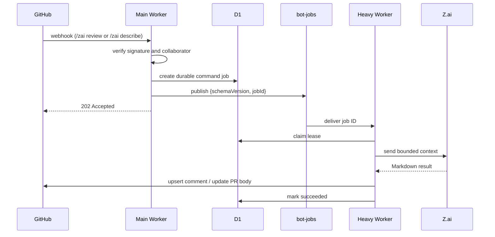

# Z.ai Code Bot Workers

This directory contains the Cloudflare Workers implementation of Z.ai Code Bot.
Only `/zai review` and `/zai describe` are supported.

## Workers

### `zai-main-worker`

Public GitHub webhook ingress. It verifies the HMAC signature, authorizes
commenters, refreshes PR context, and publishes opaque `{ schemaVersion, jobId }`
messages to the `bot-jobs` Queue. It also runs the bounded cron sweep that
recovers expired jobs and replays the outbox.

### `zai-heavy-worker`

Private Queue consumer. It claims jobs in D1 and runs the `review`, `describe`,
and internal `pr_context` handlers. It has no HTTP endpoint and no service
binding. Results are published idempotently through marker-owned GitHub
comments; `describe` also updates only its own section in the PR body.

## Command flow



Pull-request `opened`, `reopened`, `synchronize`, and `ready_for_review` events
create a `pr_context` job. The gatherer stores bounded files, diff, commits,
description, and comments in R2. A later review or describe command reuses that
snapshot and falls back to GitHub when a slice is unavailable.

## Configuration

The worker-specific bindings and routes are defined in:

- `workers/zai-main-worker/wrangler.toml`
- `workers/zai-heavy-worker/wrangler.toml`

Required secrets are `GITHUB_WEBHOOK_SECRET`, `GITHUB_TOKEN`, and `ZAI_API_KEY`.
The model is controlled by `ZAI_MODEL` and defaults to `glm-5.2`. D1, R2, KV,
and Queue bindings are shared by both workers.

## Commands

```text
/zai review
/zai describe
```

All other commands are intentionally unsupported and are not part of this
migration.

## Development

```bash
npm install
npm test
npm run dev:main
npm run dev:heavy
```

Prompt sources live in `workers/zai-heavy-worker/prompts/`; regenerate committed
prompt modules with `npm run generate:prompts` from that worker directory.
