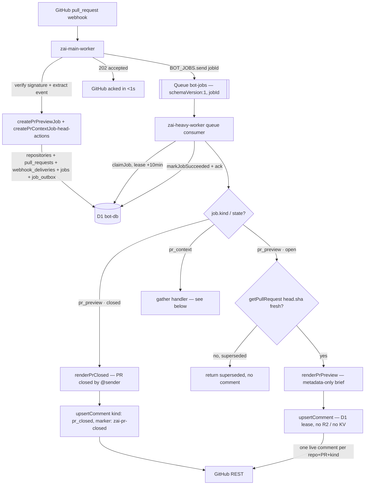
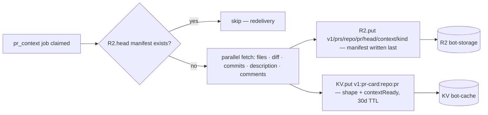
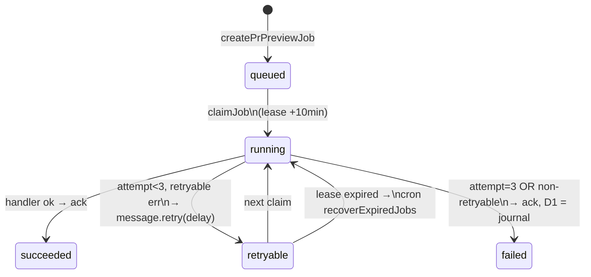
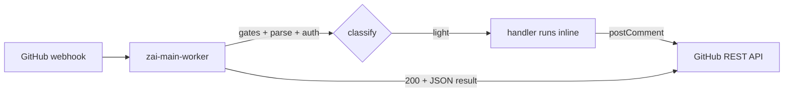
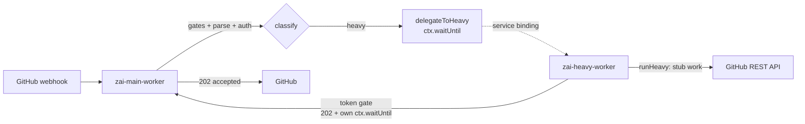

# zai-code-bot · hybrid Workers (POC v0.3)

Cloudflare **Workers** reimplementation of `zai-code-bot`, split across two
workers for scale. A **main worker** ingests GitHub webhooks, records durable
state in D1, and either runs _light_ commands inline or offloads _heavy_ work
through a **Queue** to a **heavy worker**. The heavy worker claims each job
conditionally, writes immutable artifacts to R2, and publishes one live
bot-owned PR comment — all decoupled from GitHub's ~10s webhook timeout.

```text
GitHub Webhook ──▶ zai-main-worker ──┬── pull_request ──▶ D1 job + outbox ──▶ Queue ─┐
                   (gates · record ·  │                                              │
                    parse · auth ·    ├── /zai light ──▶ inline handler             │
                    route)            └── /zai heavy ──▶ Service Binding (legacy)   │
                                                                                     ▼
                                                                          zai-heavy-worker
                                                                          (queue consumer)
```

## Why two workers

GitHub webhooks time out if a `200` isn't returned within ~10 seconds. PR
analysis (diff fetch + render + LLM calls) and all LLM-backed commands
(`/zai ask`, `/zai explain`, `/zai describe`, `/zai review`, `/zai impact`)
**cannot** complete inline. Splitting lets the
main worker acknowledge instantly while the heavy worker runs to completion on
its own lifetime budget, driven by a durable Queue.

| Worker             | Owns                                                                                                         | Driven by                                             |
| ------------------ | ------------------------------------------------------------------------------------------------------------ | ----------------------------------------------------- |
| `zai-main-worker`  | webhook ingress, signature gate, parse, auth, routing, **D1 write + queue publish**, 5-min self-healing cron | `fetch` (webhook) + `scheduled` (cron)                |
| `zai-heavy-worker` | queue consumer, job claiming, artifact writes, one-live-comment publish                                      | `queue` (consumer) + `fetch` (legacy service binding) |

## Hybrid layout

```text
poc/
├── package.json                      # root: test (vitest+coverage) + dev/deploy scripts
├── vitest.config.js                  # globals, miniflare env, v8 coverage (80%)
├── README.md
├── infra/
│   ├── bot-storage-lifecycle.json    # R2 lifecycle rule (30-day expiry on v1/ prefix)
│   └── apply-bot-storage-lifecycle.sh# applies the rule via R2 S3 API
└── workers/
    ├── shared/                       # shared lib — imported by BOTH workers
    │   ├── constants.js              #   markers, command classification, token header, BOT_FOOTER
    │   ├── commands.js               #   parseCommand / isCommand / formatHelp
    │   ├── github.js                 #   GitHubClient (REST I/O only)
    │   ├── crypto.js                 #   Web Crypto webhook-signature verify (no compat flag)
    │   ├── auth.js                   #   authorizeCommenter (collaborator policy)
    │   ├── secrets.js                #   resolveSecretValue (string | .get() | Promise)
    │   ├── logging.js                #   structured JSON logger + correlation id
    │   ├── comments.js               #   upsertComment — D1 publication lease + marker lookup
│   ├── pr-preview.js             #   renderPrPreview — metadata-only markdown brief
    │   ├── pr-context-reader.js  #   readPrCard / readContextManifest — gather's readers
    │   └── storage/                  #   D1 / R2 / KV adapters
    │       ├── database.js           #     prepare / run / batch / first helpers
    │       ├── keys.js               #     versioned key builders: R2 context/run-output + KV card/config
    │       ├── deliveries.js         #     createPrPreviewJob / createPrContextJob — atomic delivery + jobs + outbox
    │       ├── jobs.js               #     claimJob / retry / fail / lease recovery
    │       ├── artifacts.js          #     writeArtifact / deleteExpiredArtifacts (run-output tier)
    │       └── config.js             #     getRepositoryConfig (KV read-through, D1 authority)
    │
    ├── zai-main-worker/
    │   ├── wrangler.toml             #   BOT_DB / BOT_ARTIFACTS / BOT_CACHE / BOT_JOBS + cron
    │   ├── migrations/
    │   │   ├── 0001_storage_foundation.sql
    │   │   ├── 0002_storage_hardening.sql
    │   │   ├── 0003_pr_closed_by.sql
    │   │   └── 0004_pr_context_kind.sql
    │   ├── package.json
    │   └── src/
    │       ├── index.js              #   fetch: gates → record → route ; scheduled: cron sweep
    │       ├── router.js             #   classifyCommand(): light | heavy | unsupported
    │       ├── pr-events.js          #   supported PR actions + event extraction
    │       ├── job-enqueuer.js       #   enqueueJob / recoverExpiredJobs / replayDueOutbox / sweep
    │       ├── delegator.js          #   buildDelegationPayload + delegateToHeavy (legacy binding)
    │       └── handlers/
    │           ├── index.js          #   getLightHandler() — help only
    │           └── help.js           #   /zai help (implemented, no LLM call)
    │
    ├── zai-heavy-worker/
    │   ├── wrangler.toml             #   queue consumer + storage bindings
    │   ├── package.json
    │   └── src/
    │       ├── index.js              #   queue handler + legacy fetch (token-gated)
    │       ├── queue.js              #   processQueueMessage — claim → run → ack/retry/fail
    │       └── handlers/
    │           ├── index.js          #   getHeavyHandler(): ask|explain|describe|review|impact|pr_preview|pr_context
    │           ├── pr-preview.js     #   durable PR preview job (metadata-only, no R2/KV)
    │           ├── pr-context.js     #   durable PR-context gather job → R2 context + KV card
    │           ├── ask.js            #   /zai ask      (context-aware stub — LLM)
    │           ├── explain.js        #   /zai explain  (context-aware stub — LLM)
    │           ├── describe.js       #   /zai describe (stub — LLM)
    │           ├── review.js         #   /zai review   (context-aware stub — LLM)
    │           └── impact.js         #   /zai impact   (context-aware stub — LLM)
    │
    └── tests/                        #   Vitest suite — 20 files, 188 tests
        ├── commands / crypto / secrets / github / auth / logging / router .test.js
        ├── storage.test.js           #     schema + key builders + artifact expiry + render
        ├── storage-state.test.js     #     claimJob / retry / fail / lease recovery / publications
        ├── storage-runtime.test.js   #     createPrPreviewJob duplicate + outbox replay
        ├── github-storage.test.js    #     GitHubClient over D1-backed fixtures
        ├── pr-preview-sync.test.js   #     generate-once + update-on-sync (real D1 fake)
        ├── pr-preview-closed.test.js #     closed lifecycle → pr_closed comment, no supersede GET
        ├── comments-upsert.test.js   #     upsertComment PAT-bot regression (real path)
        ├── pr-events.test.js         #     supported-action gate + event extraction
        ├── config-cache.test.js      #     repo-config KV read-through (hit/miss/outage)
        ├── pr-context.test.js        #     gather: deterministic keys, idempotency, budget, degrade
        ├── pr-context-reader.test.js #     readPrCard / readContextManifest / renderers
        ├── handlers-context.test.js  #     review/impact/ask/explain read R2/KV context
        └── queue.test.js             #     retry budget (3 attempts) + terminal failure → ack
```

## Business logic

### Durable PR-preview path (the primary flow)

Every supported `pull_request` event (`opened`, `reopened`, `synchronize`,
`ready_for_review`, `edited` title changes, `closed`) is recorded durably and
processed asynchronously — the
webhook returns `202` before any analysis runs.



`createPrContextJob` runs only on head-producing actions (`opened` /
`reopened` / `synchronize` / `ready_for_review`); the `pr_context` job drives
the gather flow below. The preview itself is metadata-only — it writes
**nothing** to R2 or KV.

**Why three storage resources?** D1 is the single source of truth (authority for
deliveries, jobs, runs, artifacts, publications). R2 is the **PR-context blob
tier** — the gather job writes changed files / diff / commits / comments under
deterministic keys for the heavy handlers to reuse. KV is a **read-through
cache** of hot params (repo config, PR “card”) — never job status or
idempotency state.

**Why a tiny queue message?** The message carries only `{ schemaVersion, jobId }`.
No token, no payload, no diff. The consumer re-reads everything from D1 (and
R2 for context). This keeps the queue lossless to inspect and keeps secrets out
of it.

### Eager PR-context gather (the context tier)

For every head-producing PR event the main worker enqueues a second job
(`pr_context`) alongside the preview. The heavy worker’s gather handler fetches
the PR’s task context and writes it under deterministic R2 keys + a KV pr-card,
so the heavy `/zai` handlers read context without re-fetching GitHub:



Idempotent per head (the manifest is the commit marker, written last),
best-effort per slice (a failed fetch degrades but does not abort), and
budgeted (`maxContextBytes` truncates the diff). `review` / `impact` read the
KV card → head → R2 manifest; `ask` / `explain` read the card for the PR shape.
No LLM call yet — the readers post context-aware notices until the review
pipeline lands.

### Job lifecycle and the three-attempt budget

A job moves through a fixed state machine. The Queue is a transient delivery
channel; D1 is authoritative.



| Attempt | On failure                                        | Queue action                                    |
| ------- | ------------------------------------------------- | ----------------------------------------------- |
| 1–2     | `markJobRetryable` + `warn` log                   | `message.retry({ delaySeconds })`, exp. backoff |
| 3       | `markJobFailed('operation_failed')` + `error` log | `message.ack()` (terminal — no DLQ)             |

A crash mid-run leaves the job in `running` with an expired lease. The lease is
the safety net: `claimJob` will reclaim an `expired-lease` running job, and the
cron will requeue or fail it.

### The 5-minute cron — self-healing sweep

```toml
[triggers]
crons = ["*/5 * * * *"]
```

The `scheduled()` handler runs three independent, bounded recovery jobs:

| Job                   | Recovers                                                              | Bounded by |
| --------------------- | --------------------------------------------------------------------- | ---------- |
| `recoverExpiredJobs`  | Jobs stuck in `running` past `lease_expires_at` (crashed consumer)    | 100 rows   |
| `replayDueOutbox`     | Jobs whose `queue.send()` failed after the D1 commit                  | 25 rows    |
| `sweepExpiredStorage` | R2 objects + D1 `artifacts` rows past `expires_at` (30-day retention) | 100 rows   |

Together these make "D1 is authoritative" self-healing: duplicate deliveries
are no-ops (`claimJob` idempotency), crashed consumers recover via lease
expiry, lost publishes recover via outbox replay, and retention is enforced on
both the bucket and its index.

### Light command path (`/zai help` only)



Runs entirely inline within the webhook request. Only `help` is light — pure
formatting with no LLM call — and it is fully implemented. Every other command
(`ask`, `explain`, `describe`, `review`, `impact`) is **heavy** because it
makes a Z.ai LLM call.

### Heavy command path (`/zai ask`, `explain`, `describe`, `review`, `impact`) — legacy



This is the pre-storage service-binding delegation path. All five heavy
commands are **stubs** that post a "not yet implemented" notice. The
migration plan is to route them through the same durable Queue + D1 + R2 path
as `pr_preview` (see status below).

The double-`ctx.waitUntil` is intentional and decoupled: main schedules the
service-binding fetch and returns `202`; heavy verifies the internal token,
schedules `runHeavy(...)` in its own `ctx.waitUntil`, and returns `202`. Heavy
then runs within its own CPU/wall-time budget — main is never held alive.

## Queue message contract

```ts
// Producer → Queue → Consumer. Tiny by design: the consumer re-reads
// everything from D1/R2 by jobId.
interface QueueMessage {
  schemaVersion: 1; // STORAGE_SCHEMA_VERSION — reject mismatched messages
  jobId: string; // UUID — primary key into D1 jobs
}
```

The consumer (`processQueueMessage`) resolves every outcome through D1 and ends
with an explicit `message.ack()` or `message.retry()`. The only case it does
**not** ack is when the D1 state transition itself fails — then it
`message.retry({delaySeconds:30})` so the delivery re-runs.

## Service bindings

### Cloudflare infrastructure

| Binding type    | Name                                | Worker | Purpose                                                            |
| --------------- | ----------------------------------- | :----: | ------------------------------------------------------------------ |
| D1 database     | `BOT_DB`                            |  both  | Authority: deliveries, jobs, outbox, runs, artifacts, publications |
| R2 bucket       | `BOT_ARTIFACTS` (`bot-storage`)     | heavy  | PR task context (files/diff/commits/comments) — the blob tier      |
| KV namespace    | `BOT_CACHE` (`bot-cache`)           | heavy  | Read-through cache: repo config + PR card                          |
| Queue producer  | `BOT_JOBS` (`bot-jobs`)             |  main  | Publishes `{schemaVersion, jobId}`                                 |
| Queue consumer  | — (same queue)                      | heavy  | Consumes `bot-jobs`; claims → runs → acks/retries                  |
| Service binding | `HEAVY_WORKER` → `zai-heavy-worker` |  main  | Legacy `/zai` heavy delegation (token-gated)                       |
| Secrets Store   | id `629e5dd6…`                      |  both  | Shared store bound via `[[secrets_store_secrets]]`                 |
| Cron trigger    | `*/5 * * * *`                       |  main  | Self-healing sweep (lease / outbox / retention)                    |

### External service dependencies

| Service | Endpoint / method                         | Purpose                          |
| ------- | ----------------------------------------- | -------------------------------- |
| GitHub  | `POST /repos/{o}/{r}/issues/{n}/comments` | Publish the live preview comment |
| GitHub  | `GET /repos/{o}/{r}/pulls/{n}`            | Verify `head.sha` freshness      |

## Configuration

### Secrets — Cloudflare Secrets Store

All secrets live in one shared [Secrets Store](https://developers.cloudflare.com/secrets-store/)
and are bound into each worker via `[[secrets_store_secrets]]` in `wrangler.toml`.

> ⚠️ **A binding is not always a plain string at runtime.** Depending on the
> wrangler/workerd version, `env.<binding>` can surface as a `string`, an
> object with a `.get()` method, **or** a `Promise`. Passing it straight into
> `TextEncoder.encode()` (webhook HMAC) or an `Authorization` header
> stringifies it to `"[object Object]"` and silently breaks every signature
> check / API call. **Always** resolve it first with
> [`resolveSecretValue`](workers/shared/secrets.js):
>
> ```js
> import { resolveSecretValue } from '../../shared/secrets.js';
> const token = await resolveSecretValue(env.GITHUB_TOKEN);
> ```

Store id: `629e5dd6594845a889e6ddabb26cc009` (shared by both workers).

| `binding` (env var)     | store `secret_name`      | main | heavy | purpose                               |
| ----------------------- | ------------------------ | :--: | :---: | ------------------------------------- |
| `GITHUB_WEBHOOK_SECRET` | `ZAI_GITHUB_WEBHOOK_KEY` |  ✓   |   —   | HMAC-SHA256 webhook secret            |
| `GITHUB_TOKEN`          | `ZAI_GITHUB_TOKEN`       |  ✓   |   ✓   | GitHub PAT (repo + read:org)          |
| `ZAI_INTERNAL_TOKEN`    | `ZAI_INTERNAL_TOKEN`     |  ✓   |   ✓   | shared main<->heavy auth (must match) |
| `ZAI_API_KEY`           | `ZAI_API_KEY`            |  ✓   |   ✓   | Z.ai key (once LLM calls land)        |

> A `secrets_store_secrets` binding requires its `secret_name` to already exist
> in the store, or `wrangler deploy` fails. Local dev: copy
> `workers/<worker>/.dev.vars.example` to `.dev.vars` and fill in values (never
> commit `.dev.vars`).

### Environment variables (`[vars]`)

| Variable            | Default      | Purpose                                         |
| ------------------- | ------------ | ----------------------------------------------- |
| `NODE_ENV`          | `production` | Single production environment (no staging/dev)  |
| `ZAI_MODEL`         | `glm-5.2`    | Default Z.ai model identifier                   |
| `R2_RETENTION_DAYS` | `30`         | Passed to `artifactExpiresAt()` for R2 + D1 TTL |

### R2 retention

R2 objects live under the versioned `v1/` prefix and expire after **30 days**.
The two R2 grains are retained differently:

- **PR context (`v1/prs/`)** — written by the gather job, **not** indexed in D1
  (keys are deterministic from the PR identity). Retained solely by a
  **bucket-level lifecycle rule** on the `v1/prs/` prefix; there is no D1 row
  to sweep. Documented in both `wrangler.toml` files; apply via
  `npx wrangler r2 bucket lifecycle add bot-storage --id pr-context-retention
  --prefix "v1/prs/" --expire-days 30` (R2 lifecycle rules cannot be declared
  in `wrangler.toml`).
- **Run-outputs (`v1/runs/`)** — indexed by the `artifacts` table. Each object
  gets an `expires_at`; the 5-min cron `sweepExpiredStorage` deletes the R2
  object and its D1 row together (keeps the index consistent). The `v1/`
  lifecycle rule acts as a backstop. Reserved for future LLM `response.json` —
  no producer ships without a reader, so it is empty for now.

The bot's published comments live on GitHub + D1, **not** in R2.

## Command routing (single source of truth)

Classification lives in [`workers/shared/constants.js`](workers/shared/constants.js)
(`LIGHT_COMMANDS` / `HEAVY_COMMANDS`) and is applied by
[`workers/zai-main-worker/src/router.js`](workers/zai-main-worker/src/router.js):

```js
classifyCommand('help'); // → 'light'   (implemented — no LLM call)
classifyCommand('ask'); // → 'heavy'   (stub — LLM)
classifyCommand('explain'); // → 'heavy'   (stub — LLM)
classifyCommand('describe'); // → 'heavy'   (stub — LLM)
classifyCommand('review'); // → 'heavy'   (stub — LLM)
classifyCommand('impact'); // → 'heavy'   (stub — LLM)
```

To reclassify a command, move it between the two arrays — nothing else changes.

### `wrangler.toml` gotchas

- The old POC `[computer]` section was **removed** — it isn't a valid wrangler
  key and would fail `wrangler deploy`.
- Webhook signature verification uses the Web Crypto API (`crypto.subtle`) in
  `shared/crypto.js` — no `nodejs_compat` flag needed.
- R2 lifecycle rules **cannot** be declared in `wrangler.toml`; use the S3 API,
  dashboard, or the included shell script.

## Local development

```bash
cd poc

# Run the Vitest unit-test suite with coverage (no live API calls)
npm test            # vitest run --coverage  →  188 tests, ~96% coverage
npm run test:watch  # vitest (watch mode)

# Dev servers (run each in its own terminal)
( cd workers/zai-main-worker  && wrangler dev )   # :8787
( cd workers/zai-heavy-worker && wrangler dev )   # :8788
```

> **Service bindings + `wrangler dev`:** `wrangler dev` (local mode) supports
> service bindings only when running against the Cloudflare backend
> (`wrangler dev --remote`). For pure local testing of the delegation path, mock
> `env.HEAVY_WORKER` in a test harness.

### Smoke test (main worker, local)

```bash
SECRET=your-webhook-secret
PAYLOAD='{"action":"created","issue":{"number":1,"pull_request":{}},
          "comment":{"body":"/zai help","user":{"login":"you"}},
          "repository":{"owner":{"login":"o"},"name":"r","full_name":"o/r"}}'
SIG="sha256=$(node -e "console.log(require('crypto').createHmac('sha256','$SECRET').update('$PAYLOAD').digest('hex'))")"

curl -sX POST http://localhost:8787 \
  -H "Content-Type: application/json" \
  -H "X-GitHub-Event: issue_comment" \
  -H "X-Hub-Signature-256: $SIG" \
  -d "$PAYLOAD"
```

## Deployment

```bash
cd poc
npm run deploy:heavy   # deploy heavy FIRST (queue consumer must exist)
npm run deploy:main
```

Then point the GitHub webhook at the main worker's public route —
`https://zai-worker.tokenbel.info` — content-type `application/json`, with the
webhook secret = the value stored as `ZAI_GITHUB_WEBHOOK_KEY`. Subscribe to the
`pull_request` and `issue_comment` events.

## Bug fixes folded into the restructure

| POC bug                                                                        | Fix                                                                                                 |
| ------------------------------------------------------------------------------ | --------------------------------------------------------------------------------------------------- |
| `verifyWebhookSignature` used Node `crypto.createHmac` → needs `nodejs_compat` | New `shared/crypto.js` uses Web Crypto `crypto.subtle` (verified against Node `createHmac` fixture) |
| `createLogger` `info/warn/error/debug` lost `this` and threw at runtime        | Methods now close over `log` directly — no `this` dependency                                        |
| Error comments leaked raw `error.message` into PRs                             | Error comments now post a sanitized generic message                                                 |
| Comment publish raced (POST before D1 insert) → duplicate comments             | `upsertComment` now takes a D1 publication lease keyed on `(repository, PR, kind)`                  |
| Jobs stuck `running` after consumer crash                                      | Bounded lease (`+10min`) + `recoverExpiredJobs` cron requeue/fail                                   |
| Hard-coded retention values; orphan R2 after D1 row deletion                   | Uniform `R2_RETENTION_DAYS=30` + `sweepExpiredStorage` + R2 lifecycle backstop                      |

## Testing

```bash
cd poc && npm test        # vitest run --coverage  →  188 tests, ~96% coverage
npm run test:watch        # vitest in watch mode
```

Vitest with `vitest-environment-miniflare` (Workers-runtime fidelity) and
`@vitest/coverage-v8`, enforcing **80%** thresholds. The 20 test files mirror
the source layout — one per shared module plus dedicated suites for the storage
state machine, queue retry budget, gather pipeline, and context readers.

## Status and roadmap

| Capability                                                    | Status                                                          |
| ------------------------------------------------------------- | --------------------------------------------------------------- |
| Webhook ingress + signature gate                              | ✅ implemented                                                  |
| Light `help` handler                                          | ✅ implemented                                                  |
| Durable PR-preview job (D1 + Queue, metadata-only)            | ✅ implemented                                                  |
| Eager PR-context gather (R2 context + KV card)               | ✅ implemented                                                  |
| Context-aware review/impact/ask/explain                      | 🟡 stub (read gathered context; LLM pending)                    |
| 3-attempt retry budget + lease recovery                       | ✅ implemented                                                  |
| One-live-comment publication (D1 lease)                       | ✅ implemented                                                  |
| 30-day retention + cron sweep                                 | ✅ implemented                                                  |
| `/zai ask`/`explain`/`describe`/`review`/`impact` (heavy LLM) | 🟡 stub (legacy service-binding path; migrate to durable queue) |
| Z.ai LLM integration                                          | ⬜ not started                                                  |
| `.zai-scheduled.yml` regeneration flows                       | ⬜ not started                                                  |

## Related

- Parent GitHub Action source: `../src/` (canonical handlers to port)
- Command parser reference: `../src/lib/commands.js`
- Authorization model: `../src/lib/auth.js`
- Original flat POC: replaced by this hybrid layout (v0.1 → v0.3)

---

**Version**: 0.4.0 · eager PR-context gather tier (R2 `v1/prs/` context + KV pr-card; migration 0004 adds the `pr_context` job kind + `UNIQUE(delivery_id, kind)`); review/impact/ask/explain read gathered context; preview stays metadata-only (no R2/KV); repo-config cache is read-through
