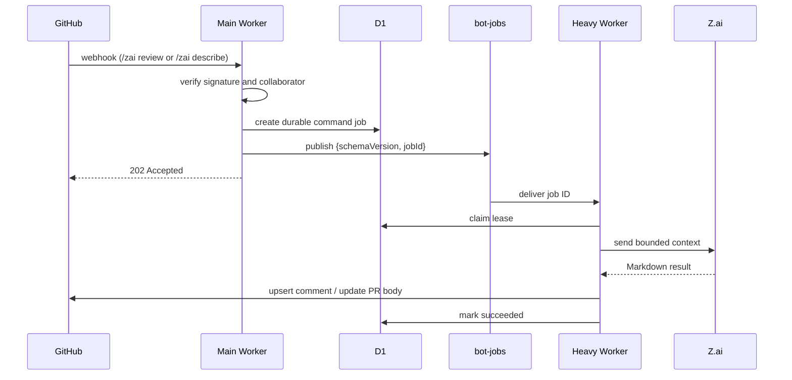

# Z.ai Code Bot Workers

This directory contains the Cloudflare Workers implementation of Z.ai Code Bot.
`/zai help`, `/zai review`, and `/zai describe` are supported. Help is handled
inline by the main Worker; review and describe remain durable Queue jobs.

## Workers

### `zai-main-worker`

Public GitHub webhook ingress. It verifies the HMAC signature, authorizes
commenters, refreshes PR context, and publishes opaque `{ schemaVersion, jobId }`
messages to the `bot-jobs` Queue. It also runs the bounded cron sweep that
recovers expired jobs and replays the outbox.

### `zai-heavy-worker`

Private Queue consumer. It claims jobs in D1 and runs the `review`, `describe`,
`pr_context`, and internal `pr_summary` handlers. It has no HTTP endpoint and
no service binding. Review/describe results are published idempotently through
marker-owned GitHub comments; `describe` also updates only its own section in
the PR body. `pr_summary` stores structured JSON context in R2 and does not
publish a GitHub comment.

## Command flow



`/zai help` is handled inline by the main Worker after signature verification
and authorization; it posts the command list without creating a D1 job or
publishing to the Queue.

Pull-request `opened`, `reopened`, `synchronize`, and `ready_for_review` events
create a `pr_context` job. The gatherer stores bounded files, diff, commits,
description, and comments in R2. After the manifest is committed, it creates an
idempotent `pr_summary` job for the same PR head and publishes it immediately
when the heavy worker's queue producer is available; the D1 outbox remains the
recovery path. That job sends all five gathered slices to Z.ai, validates the
structured JSON response, and stores it at
`v1/prs/{repositoryId}/{prNumber}/context/pr-summary.json`. A later review
command uses a matching-head summary as auxiliary context and still treats the
raw diff as authoritative.

## Configuration

The worker-specific bindings and routes are defined in:

- `workers/zai-main-worker/wrangler.toml`
- `workers/zai-heavy-worker/wrangler.toml`

Required secrets are `GITHUB_WEBHOOK_SECRET`, `GITHUB_TOKEN`, and `ZAI_API_KEY`.
The model is controlled by `ZAI_MODEL` and defaults to `glm-5.2`. D1, R2, KV,
and Queue bindings are shared by both workers.

## Commands

```text
/zai help
/zai review
/zai describe
```

All other commands are intentionally unsupported and are not part of this
migration.

## Development

```bash
npm install
npm test
npm run dev:main
npm run dev:heavy
```

Prompt sources live in `workers/zai-heavy-worker/prompts/`; regenerate committed
prompt modules with `npm run generate:prompts` from that worker directory.
