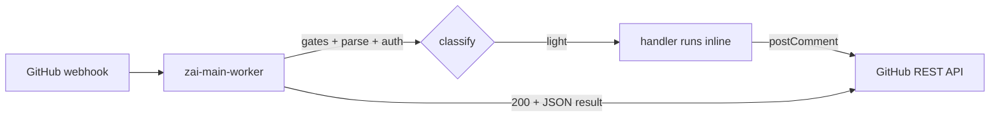
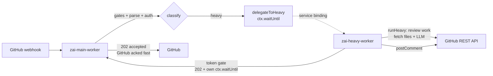

# zai-code-bot · hybrid Workers (POC v0.2)

Cloudflare **Workers** reimplementation of `zai-code-bot`, architected for scale
by splitting work across two workers: a **main worker** that ingests GitHub
webhooks and runs _light_ commands, and a **heavy worker** that runs
_resource-heavy_ commands (code review, impact analysis) offloaded via a
**Service Binding**.

This evolves the flat single-Worker POC (`poc/src/...`, v0.1) into a structure
that scales: heavy commands can no longer block webhook acknowledgement, and the
two workers can be tuned, scaled, and rolled independently.

```text
GitHub Webhook ──▶ zai-main-worker ──light──▶ inline (help/describe/…)
                   (gates, parse, auth) │
                                       └──heavy──▶ zai-heavy-worker ──▶ review/impact
                                                  (Service Binding)      (posts comment)
```

## Why two workers?

GitHub webhooks time out if a `200` isn't returned within ~10 seconds. Commands
like `/zai review` and `/zai impact` do large-diff fetches + long LLM calls
(30–60s+) and **cannot** complete inline. Splitting lets the main worker
acknowledge instantly while the heavy worker runs to completion on its own
lifetime budget.

| Worker             | Owns                                         | Commands                                     | Typical latency             |
| ------------------ | -------------------------------------------- | -------------------------------------------- | --------------------------- |
| `zai-main-worker`  | webhook ingress, gates, parse, auth, routing | `help`, `ask`, `explain`, `describe` (light) | < 1–5s inline               |
| `zai-heavy-worker` | offloaded long-running analysis              | `review`, `impact` (heavy)                   | acks in ms; work runs async |

## Hybrid layout

```text
poc/
├── package.json                      # root: test + per-worker dev/deploy scripts
├── README.md
└── workers/
    ├── shared/                       # shared lib — imported by BOTH workers (relative paths)
    │   ├── constants.js              #   markers, command classification, internal-token header
    │   ├── commands.js               #   parseCommand / isCommand / formatHelp
    │   ├── github.js                 #   GitHubClient (REST I/O only)
    │   ├── crypto.js                 #   Web Crypto webhook-signature verify (no compat flag)
    │   ├── auth.js                   #   authorizeCommenter (collaborator policy)
    │   └── logging.js                #   structured JSON logger (this-binding bug fixed)
    │
    ├── zai-main-worker/
    │   ├── wrangler.toml             #   declares HEAVY_WORKER service binding
    │   ├── package.json
    │   └── src/
    │       ├── index.js              #   fetch handler: gates → parse → auth → route
    │       ├── router.js             #   classifyCommand(): light | heavy | unsupported
    │       ├── delegator.js          #   buildDelegationPayload() + delegateToHeavy(ctx.waitUntil)
    │       └── handlers/
    │           ├── index.js          #   getLightHandler()
    │           ├── help.js           #   /zai help  (working)
    │           └── describe.js       #   /zai describe (stub)
    │
    ├── zai-heavy-worker/
    │   ├── wrangler.toml
    │   ├── package.json
    │   └── src/
    │       ├── index.js              #   internal fetch: token gate → 202 ack → ctx.waitUntil
    │       └── handlers/
    │           ├── index.js          #   getHeavyHandler()
    │           ├── review.js         #   /zai review  (stub)
    │           └── impact.js         #   /zai impact  (stub)
    │
    └── tests/
        └── test.js                   #   pure-module tests (commands, crypto, router, logger)
```

## Request lifecycle

### Light command (e.g. `/zai help`)



### Heavy command (e.g. `/zai review`)



The double-`ctx.waitUntil` is intentional and **decoupled**:

1. **Main** schedules `env.HEAVY_WORKER.fetch(...)` in its `ctx.waitUntil` and
   returns `202` to GitHub. Main's only job is to _send_ the delegation.
2. **Heavy** verifies the internal token, schedules `runHeavy(...)` in **its own**
   `ctx.waitUntil`, and returns `202` to main. The heavy worker then runs the
   long work within its own CPU/wall-time budget — main is never held alive for
   the duration of the review.

### Delegation protocol (main → heavy)

```text
POST  https://zai-heavy-worker.internal/handle
      x-zai-internal-token: <ZAI_INTERNAL_TOKEN>     (defense-in-depth)
      content-type: application/json
      {
        "command": { "type": "review", "args": "...", "isValid": true },
        "repository": { "owner", "name", "full_name" },
        "issue": { "number" },
        "prNumber": <number|null>,
        "comment": { "id", "body", "user" },
        "sender": "<login>|null"
      }
```

The heavy worker is **not** exposed publicly — it is reachable only through the
`HEAVY_WORKER` service binding from the main worker. The shared token header is
defense-in-depth in case the binding is ever reconfigured.

## Command routing (single source of truth)

Classification lives in [`workers/shared/constants.js`](workers/shared/constants.js)
(`LIGHT_COMMANDS` / `HEAVY_COMMANDS`) and is applied by
[`workers/zai-main-worker/src/router.js`](workers/zai-main-worker/src/router.js):

```js
classifyCommand('help'); // → 'light'
classifyCommand('describe'); // → 'light'
classifyCommand('ask'); // → 'light'   (handler TODO)
classifyCommand('explain'); // → 'light'   (handler TODO)
classifyCommand('review'); // → 'heavy'
classifyCommand('impact'); // → 'heavy'
```

To reclassify a command (e.g. move `explain` to heavy once you measure it
exceeding the ack budget), move it between the two arrays — nothing else changes.

## Configuration

### Secrets — Cloudflare Secrets Store (not per-worker secrets)

All secrets live in one shared [Secrets Store](https://developers.cloudflare.com/secrets-store/)
and are bound into each worker via `[[secrets_store_secrets]]` in `wrangler.toml`.

> ⚠️ **A binding is not always a plain string at runtime.** Depending on the
> wrangler/workerd version, `env.<binding>` can surface as a `string`, an
> object with a `.get()` method, **or** a `Promise`. Passing it straight into
> `TextEncoder.encode()` (webhook HMAC) or an `Authorization` header
> stringifies it to `"[object Object]"` and silently breaks every signature
> check / API call. **Always** resolve it first with
> [`resolveSecretValue`](workers/shared/secrets.js) (`workers/shared/secrets.js`):
>
> ```js
> import { resolveSecretValue } from '../../shared/secrets.js';
> const token = await resolveSecretValue(env.GITHUB_TOKEN);
> ```
>
> This mirrors the proven pattern in `cf_workers/common/utils.ts`. The webhook
> secret, `GITHUB_TOKEN`, and `ZAI_INTERNAL_TOKEN` are all resolved this way in
> both workers.

Store id: `629e5dd6594845a889e6ddabb26cc009` (shared by both workers).

| `binding` (env var code reads) | store `secret_name`      | main | heavy | purpose                               |
| ------------------------------ | ------------------------ | :--: | :---: | ------------------------------------- |
| `GITHUB_WEBHOOK_SECRET`        | `ZAI_GITHUB_WEBHOOK_KEY` |  ✓   |   —   | HMAC-SHA256 webhook secret            |
| `GITHUB_TOKEN`                 | `ZAI_GITHUB_TOKEN`       |  ✓   |   ✓   | GitHub PAT (repo + read:org)          |
| `ZAI_INTERNAL_TOKEN`           | `ZAI_INTERNAL_TOKEN`     |  ✓   |   ✓   | shared main<->heavy auth (must match) |
| `ZAI_API_KEY`                  | `ZAI_API_KEY`            |  ✓   |   ✓   | Z.ai key (once LLM calls land)        |

> A `secrets_store_secrets` binding requires its `secret_name` to already exist
> in the store, or `wrangler deploy` fails. Populate the store via the Cloudflare
> dashboard (Workers & Pages → Secrets Store) or the wrangler `secrets-store`
> commands. `ZAI_API_KEY` and `ZAI_GITHUB_WEBHOOK_KEY` already exist; add
> `ZAI_GITHUB_TOKEN` and `ZAI_INTERNAL_TOKEN` before first deploy.

Local dev: `cp workers/<worker>/.dev.vars.example workers/<worker>/.dev.vars`
and fill in values (never commit `.dev.vars`); `wrangler dev` reads them.

### Service binding

Declared in [`workers/zai-main-worker/wrangler.toml`](workers/zai-main-worker/wrangler.toml):

```toml
[[services]]
binding  = "HEAVY_WORKER"
service  = "zai-heavy-worker"
```

This exposes `env.HEAVY_WORKER.fetch(...)` inside the main worker.

### `wrangler.toml` gotchas carried over from the POC

- The old POC `[computer]` section was **removed** — it isn't a valid wrangler
  key and would fail `wrangler deploy`. (It was always "reserved".)
- Webhook signature verification no longer needs `nodejs_compat`: it uses the
  Web Crypto API (`crypto.subtle`) in `shared/crypto.js`.

## Local development

```bash
cd poc

# Run the unit test suite (pure modules only — no live API calls)
npm test

# Dev servers (run each in its own terminal)
( cd workers/zai-main-worker  && wrangler dev )   # :8787
( cd workers/zai-heavy-worker && wrangler dev )   # :8788
```

> **Service bindings + `wrangler dev`:** `wrangler dev` (local mode) supports
> service bindings only when running against the Cloudflare backend
> (`wrangler dev --remote`). For pure local testing of the delegation path, mock
> `env.HEAVY_WORKER` in a test harness.

### Smoke test (main worker, local)

```bash
SECRET=your-webhook-secret
PAYLOAD='{"action":"created","issue":{"number":1,"pull_request":{}},
          "comment":{"body":"/zai help","user":{"login":"you"}},
          "repository":{"owner":{"login":"o"},"name":"r","full_name":"o/r"}}'
SIG="sha256=$(node -e "console.log(require('crypto').createHmac('sha256','$SECRET').update('$PAYLOAD').digest('hex'))")"

curl -sX POST http://localhost:8787 \
  -H "Content-Type: application/json" \
  -H "X-GitHub-Event: issue_comment" \
  -H "X-Hub-Signature-256: $SIG" \
  -d "$PAYLOAD"
```

## Deployment

```bash
cd poc
npm run deploy:heavy   # deploy heavy FIRST (main's binding must resolve)
npm run deploy:main
```

Then point the GitHub webhook at the main worker's public route —
`https://zai-worker.tokenbel.info` (the custom route in `wrangler.toml`;
`workers.dev` is inferred off once a route is set) — content-type
`application/json`, with the webhook secret = the value stored as
`ZAI_GITHUB_WEBHOOK_KEY`.

## Bug fixes folded into the restructure

| POC bug                                                                                   | Fix                                                                                                 |
| ----------------------------------------------------------------------------------------- | --------------------------------------------------------------------------------------------------- |
| `verifyWebhookSignature` used Node `crypto.createHmac` / `Buffer` → needs `nodejs_compat` | New `shared/crypto.js` uses Web Crypto `crypto.subtle` (verified against Node `createHmac` fixture) |
| `createLogger` `info/warn/error/debug` lost `this` and threw at runtime                   | Methods now close over `log` directly — no `this` dependency                                        |
| Error comments leaked raw `error.message` into PRs                                        | Error comments now post a sanitized generic message                                                 |

## Migration roadmap (POC → full bot)

1. **Light handlers** — implement `handlers/ask.js`, `handlers/explain.js` in the
   main worker (port from repo-root `src/lib/handlers/`, re-pointing shared deps
   to `workers/shared/`). Measure latency; if >~5s, reclassify to heavy.
2. **Heavy handlers** — implement `handlers/review.js`, `handlers/impact.js`:
   paginated file fetch (`GitHubClient.getPrFiles`), bounded prompt, Z.ai API
   call with retry/backoff, threaded marker-idempotent comment.
3. **Shared API client** — port `src/lib/api.js` (Z.ai client + retry) into
   `workers/shared/zai-api.js`; the `ZAI_API_KEY` binding already resolves from
   the Secrets Store.
4. **Comment idempotency** — port `findCommentByMarker` / `upsertComment` from
   `src/lib/comments.js` into `workers/shared/comments.js`.
5. **Scheduled tasks** — add a third worker (or a Cron Trigger on the heavy
   worker) for `.zai-scheduled.yml` regeneration flows.
6. **Auto-review** — wire `pull_request` `opened`/`synchronize` events on the
   main worker to delegate to the heavy worker's review handler.

## Testing

```bash
cd poc && npm test        # 36 assertions: parsing, allowlist, help format,
                          # GitHubClient, Web Crypto, router, logger regression
```

## Related

- Parent GitHub Action source: `../src/` (canonical handlers to port)
- Command parser reference: `../src/lib/commands.js`
- Authorization model: `../src/lib/auth.js`
- Original flat POC: replaced by this hybrid layout (v0.1 → v0.2)

---

**Status**: hybrid scaffold ready · `/zai help` functional · heavy path delegated (stubs) · **Version**: 0.2.0
